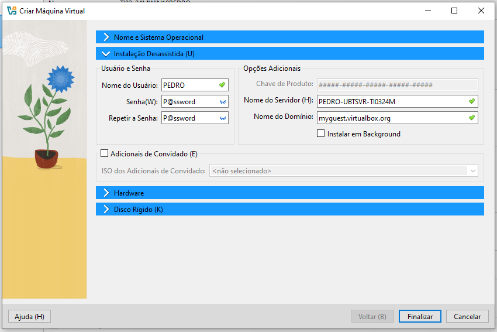
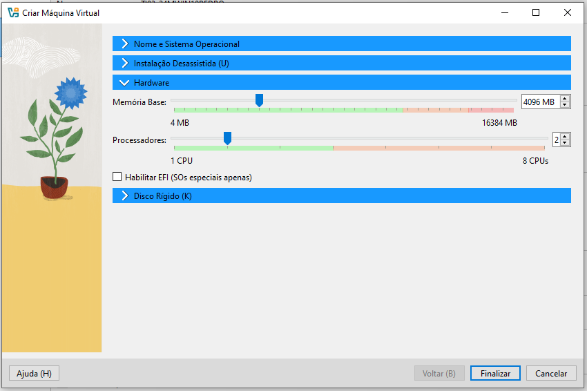
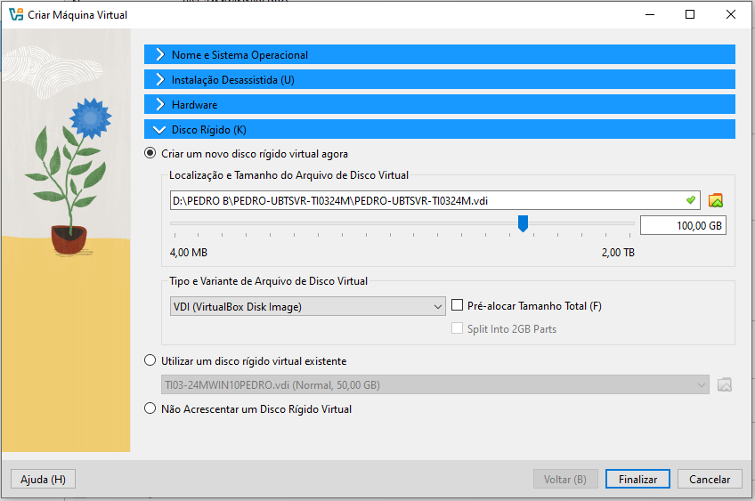
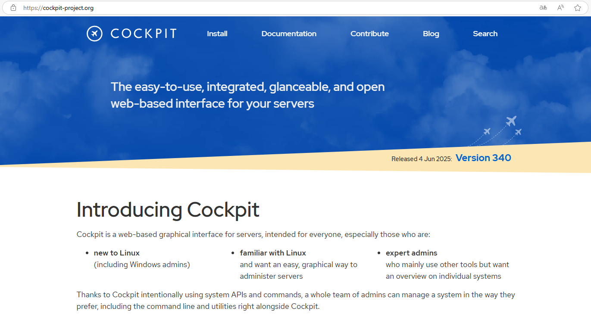

# Preparação de Ambiente
Ciar uma máquina virtual para intstalar as ferremantas e dependncias para o estudo de algorimtimo e lógica de progamação.


## Criar o diretório Base
 Vamos criar um diretório p/ armazenar a nossa máquina virtual.  Será criada no Drive D. Nomeada com o nome do usuário


## Preparação da máquina virtual
### Vamos usar a ferramenta de virtualização chamada Virtual Box


<a href="https://www.virtualbox.org/wiki/Downloads"> Faça o download aqui</a>

## Criando a Máquina Virtual
Clique no botão "Novo" para abrir a tela abaixo


depois clique na aba de "Instalação Desassistida".



nela você ira configurar a seu nome de usuário e senha como na imagem acima,
 depois clique em "Hardware".



No "Hardware" você ira alocar a quantidade de memoria que iremos utlizar na máquina, 
nesse caso iremos com usar 4096 de memoria base e 2 processadores. Agora vá para a aba de "Disco Rígido".


 
Aqui você ira alocar a quantidade de memoria o armazenamento da máquina virtual terá.

Depois de passsa por todos esses passos você pode clicar no botão "Finalizar"

## Pós Instalação 

Para atualizar o sistema iremos usar os segguintes comandos :

```shell
sudo apt update -y
````

```shell
sudo apt upgrade -y
```

```shell
reboot
```
## Instalação do cockpit

Ferramenta para gerenciar o servidor, por meio de um ambiente gráfico online



#### comando para intstalar o cockpit

```shell
sudo apt install cockpit
```
