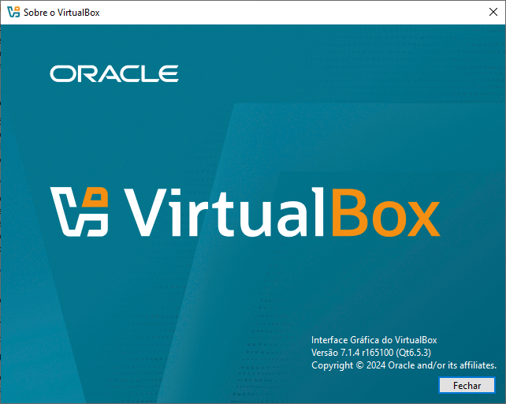

# Preparação de Ambiente
Ciar uma máquina virtual para intstalar as ferremantas e dependncias para o estudo de algorimtimo e lógica de progamação.

## Criar o diretório Base
 Vamos criar um diretório p/ armazenar a nossa máquina virtual.  Será criada no Drive D. Nomeada com o nome do usuário

## Preparação da máquina virtual
### Vamos usar a ferramenta de virtualização chamada Virtual Box

<a href="https://www.virtualbox.org/wiki/Downloads"> Faça o download aqui</a>

## Criando a Máquina Virtual

